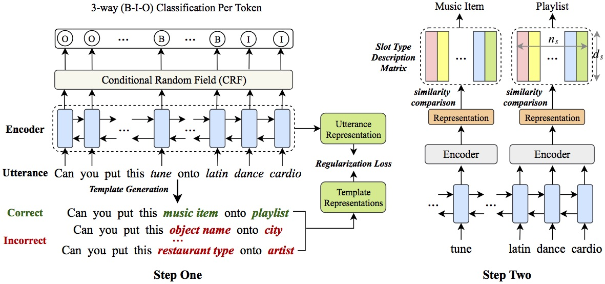

# Coach: A Coarse-to-Fine Approach for Cross-domain Slot Filling

 [](https://opensource.org/licenses/MIT)


This repository is for the ACL-2020 paper: [Coach: A Coarse-to-Fine Approach for Cross-domain Slot Filling](https://128.84.21.199/abs/2004.11727). It contains the scripts for the coach framework and the baseline models [CT](https://arxiv.org/pdf/1707.02363.pdf) and [RZT](https://arxiv.org/pdf/1906.06870.pdf).

This code has been written using PyTorch. If you use any source codes or ideas included in this repository for your work, please cite the following paper.
<pre>
@article{liu2020coach,
    title={Coach: A Coarse-to-Fine Approach for Cross-domain Slot Filling},
    author={Zihan Liu and Genta Indra Winata and Peng Xu and Pascale Fung},
    journal={arXiv preprint arXiv:2004.11727},
    year={2020},
}
</pre>

## Abstract
As an essential task in task-oriented dialog systems, slot filling requires extensive training data in a certain domain. However, such data are not always available.
Hence, cross-domain slot filling has naturally arisen to cope with this data scarcity problem.
In this paper, we propose a Coarse-to-fine approach (Coach) for cross-domain slot filling. Our model first learns the general pattern of slot entities by detecting whether tokens are slot entities or not. It then predicts the specific types for the slot entities. In addition, we propose a template regularization approach to improve the adaptation robustness by regularizing the representation of utterances based on utterance templates.
Experimental results show that our model significantly outperforms state-of-the-art approaches in slot filling. Furthermore, our model can also be applied to the cross-domain named entity recognition task, and it achieves better adaptation performance than other existing baselines.

## Coach Framework


## Data
- ```Cross-domain Slot Filling:``` Evaluated on [SNIPS](https://arxiv.org/pdf/1805.10190.pdf) dataset, which contains 39 slot types across seven domains (intents) and ~2000 training samples per domain.

- ```Cross-domain named entity recognition (NER):``` We take CoNLL-2003 English named entity recognition (NER) dataset as the source domain and the [CBS SciTech News NER](https://github.com/jiachenwestlake/Cross-Domain_NER/tree/master/unsupervised_domain_adaptation/data/news_tech) dataset as the target domain.

## Preprocessing
Preprocessing scripts for cross-domain slot filling and NER are in the [preprocess](https://github.com/zliucr/coach/tree/master/preprocess) folder. We list the preprocess details for each file as follows:
- ```slu_preprocess.py:``` The script for preprocessing the data in slot filling task.
- ```gen_embeddings_for_slu.py:``` The script for the slot filling task. It contains domain descriptions, slot descriptions, and the functions for generating embeddings for the slot filling task vocabulary and the embeddings for domains and slots.
- ```gen_example_emb_for_slu_baseline.py:``` The script for RZT baseline in the slot filling task. It contains slot examples and the function for generating embeddings for them.
- ```gen_embeddings_for_ner.py:``` The script for the NER task. It contains entity descriptions, entity examples (for the RZT baseline), and the functions for generating embeddings for the NER task vocabulary as well as the embeddings for entities and entity examples.

### Notes
- We utilize [fastText](https://fasttext.cc/docs/en/pretrained-vectors.html) to get the word-level embeddings including the embeddings for those out of vocabulary (oov) words.
- The original datasets, the preprocessed data and the preprocessed embeddings can be downloaded [here](https://drive.google.com/drive/folders/1ydalMtB-hpfS3SIEaR5UbRfEe2m8bFcj?usp=sharing) (Check in the **data** folder).

## How to run
### Configuration
- ```--tgt_dm:``` Target domain
- ```--n_samples:``` Number of samples used in the target domain
- ```--tr:``` Template regularization flag
- ```--enc_type:``` Encoder type for encoding entity tokens in the Step Two
- ```--model_path:``` Saved model path

### Cross-domain Slot Filling
Train Coach model for 50-shot adaptation to AddToPlaylist domain
```console
❱❱❱ python slu_main.py --exp_name coach_lstmenc --exp_id atp_50 --bidirection --freeze_emb --tgt_dm PlayMusic --n_samples 50
```

Train Coach + Template Regularization (TR) for 50-shot adaptation to AddToPlaylist domain
```console
❱❱❱ python slu_main.py --exp_name coach_tr_lstmenc --exp_id atp_50 --bidirection --freeze_emb --tr --tgt_dm AddToPlaylist --emb_file ./data/snips/emb/slu_word_char_embs_with_slotembs.npy --n_samples 50
```

Train CT model (baseline) for 50-shot adaptation to AddToPlaylist target domain
```console
❱❱❱ python slu_baseline.py --exp_name ct --exp_id atp_50 --bidirection --freeze_emb --lr 1e-4 --hidden_dim 300 --tgt_dm AddToPlaylist --n_samples 50
```

Train RZT model (baseline) for 50-shot adaptation to AddToPlaylist target domain
```console
❱❱❱ python slu_baseline.py --exp_name rzt --exp_id atp_50 --bidirection --freeze_emb --lr 1e-4 --hidden_dim 200 --use_example --tgt_dm AddToPlaylist --n_samples 50
```

Test Coach model on the AddToPlaylist target domain
```console
❱❱❱ python slu_test.py --model_path ./experiments/coach/atp_50/best_model.pth --model_type coach --n_samples 50 --tgt_dm AddToPlaylist
```

Test Coach model on seen and unseen slots for the AddToPlaylist target domain
```console
❱❱❱ python slu_test.py --model_path ./experiments/coach_lstmenc/atp_50/best_model.pth --model_type coach --n_samples 50 --tgt_dm AddToPlaylist --test_mode seen_unseen
```

### Cross-domain NER
Train Coach model for zero-shot adaptation
```console
❱❱❱ python ner_main.py --exp_name coach --exp_id ner_0 --bidirection --emb_file ./data/ner/emb/ner_embs.npy --emb_dim 300 --trs_hidden_dim 300 --lr 1e-4
```

Train CT model for zero-shot adaptation
```console
❱❱❱ python ner_baseline.py --exp_name ct --exp_id ner_0 --bidirection --emb_file ./data/ner/emb/ner_embs.npy --emb_dim 300 --lr 1e-4
```

Train RZT model for zero-shot adaptation
```console
❱❱❱ python ner_baseline.py --exp_name rzt --exp_id ner_0 --bidirection --emb_file ./data/ner/emb/ner_embs.npy --emb_dim 300 --lr 1e-4 --hidden_dim 150 --use_example
```

### Notes
- A full set of commands can be found in [run.sh](https://github.com/zliucr/coach/blob/master/run.sh)
- All the models can be downloaded [here](https://drive.google.com/drive/folders/1ydalMtB-hpfS3SIEaR5UbRfEe2m8bFcj?usp=sharing) (Check in the **experiments** folder) to reproduce our results.
